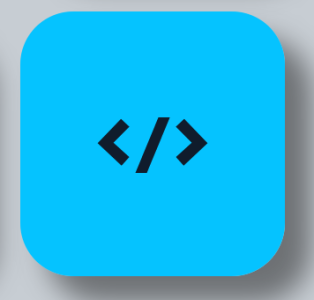
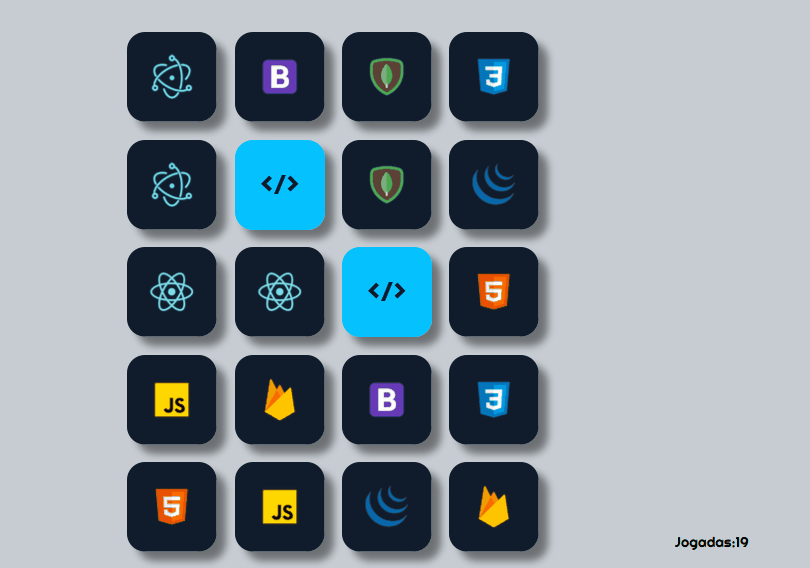

<h1 align="center">
 
  
 
 
Memory
</h1>

This is a memory game made to test my skills at html, css, js.   I've learn a lot about how to manipulate arrays, objects, functions and the DOM.

  

[//]: # (Add your gifs/images here:)

  

## Getting started

Just clone the repository and open index.html in a browser ;D

## License

This project is licensed under the MIT License - see the [LICENSE](https://opensource.org/licenses/MIT) page for details.
